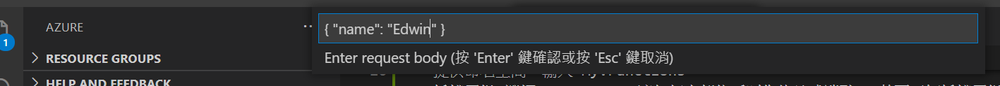
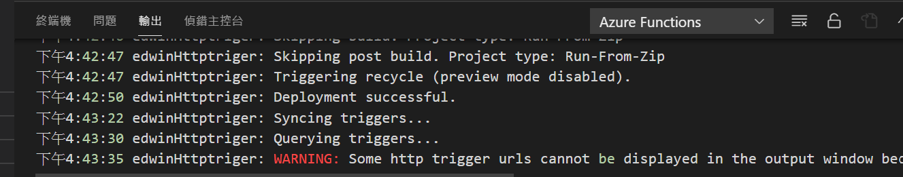

# Azure Functions
Azure Functions是一種事件驅動的雲端服務, 可用來回應資料庫變更、處理IoT資料流程、管理訊息佇列等。

# 參考文件
[官方文件檔](https://docs.microsoft.com/zh-tw/azure/azure-functions/)

# 環境準備
  - Azure 帳戶
  - [Azure Functions Core Tools](https://docs.microsoft.com/zh-tw/azure/azure-functions/functions-run-local?tabs=windows%2Ccsharp%2Cbash#install-the-azure-functions-core-tools)
  - Visual Studio Code
  - [Visual Studio Code C#延伸模組](https://marketplace.visualstudio.com/items?itemName=ms-dotnettools.csharp)
  - [Visual Studio Code Azure Functions延伸模組](https://marketplace.visualstudio.com/items?itemName=ms-azuretools.vscode-azurefunctions)

# 建立一個Azure Functions
  1. 選擇Azure icon, 再點選[建立新專案] icon。
  
  
  
  2. 選擇您專案工作區的目錄位置，然後選擇 [選取] 。
  
  3. 依提示輸入下列資訊
  - 選取所要開發的語言: C#
  - 選取專案所要的範本 (PS:在visual code 安裝好Azure Function延伸模組, 無法選取範本, 但其他語言的可以, 但後來莫  名其妙好了, 參考[Stackoverflow](https://stackoverflow.com/questions/65214019/%20%20triggers-list-not-showing-for-c-sharp-in-visual-studio-code-windows-os-for-azure)
  - 或可以用command line方式來建立[參考網圵](https://docs.microsoft.com/en-us/azure/azure-functions/create-first-function-cli-csharp?tabs=azure-cli%2Cbrowser)
  - 提供函式名稱: 輸入 HttpExample
  - 提供命名空間：輸入 My.Functions
  - 授權層級 選擇 Anonymous，讓任何人都能呼叫您的函式端點。 若要了解授權層級，請參閱[授權金鑰](https://docs.microsoft.com/zh-tw/azure/azure-functions/functions-bindings-http-webhook-trigger?tabs=csharp#authorization-keys)
  - 選取您開啟專案的方式：選擇 Add to workspace
  4. 深入了解所建立的檔案, 請參閱[產生的專案檔](https://docs.microsoft.com/zh-tw/azure/azure-functions/functions-develop-vs-code?tabs=csharp#generated-project-files)
  
# 在本機執行函式
  1. 直接按[F5]執行啟動專案函式, 應可在終端機出現函式URL
  
  
  
  2. 選擇Azure icon, 在建立的函式上右鍵點選[Execute Function Now...]
  
  
  
  3. 在輸入框中, 可輸入所要帶入"name"值, 即可接受到response訊息
  
  
  
  
  
  4. 按 ctrl + c 即可中斷連線
  
# 發佈至Azure
  - 在Visual Code要先登入Azure, 選擇Azure icon, 再點選 "Sign in to Azure..."
  - 選擇Azure icon, 再點選 "Deploy to Function App..."
  
  
  
  - 如果沒有開啟函式的資料夾, 會先要你選取該資料夾
  - 選取訂閱帳戶
  - 在 Azure 中選取函式應用程式：選擇 "Create new Function App in Azure..."
  
  
  
  - 輸入全球唯一的函式名稱, 若有重覆到別人的會要求重新命名
  
  
  
  - 選擇所要存放區域
  
  
  
  - 完成後可檢視輸出
  
  
  
# 在Azure執行函式
  - 回到Azure icon, 在自己的訂閱帳戶中, 應可看到所發佈的函式
  - 在建立的函式上右鍵點選[Execute Function Now...]
  
  
  
  - 應該和本機執行一樣會得到一個response
  
  

# 清除資源
  - 清除所有資源, 以免產生其它額外費用
  - 在Visual Code按 F1, 並選擇 "Azure Functions: Open in Portal..."

  

  - 在 "概觀" 中, 再點選 "資源群組"

  

  - 確認要刪除的項目, 再點選 "刪除" 

  

  - 在彈出的視窗的提示中回答 "是", 按下 "刪除" 即可

   

